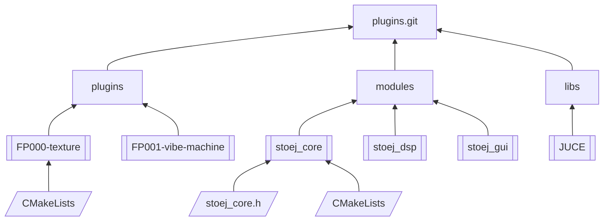

# Plugins
To group plugins as submodules

Organization losely based on: https://github.com/eyalamirmusic/JUCECmakeRepoPrototype

```mermaid
graph BT

plugins --> plugins.git
modules --> plugins.git
JUCE[[JUCE]] --> libs --> plugins.git
fp000[[FP000-texture]] --> plugins
fp001[[FP001-vibe-machine]] --> plugins
core[[stoej_core]] --> modules
dsp[[stoej_dsp]] --> modules
gui[[stoej_gui]] --> modules
cmake1[/CMakeLists/] --> fp000
coreh[/stoej_core.h/] --> core
cmake2[/CMakeLists/] --> core
```